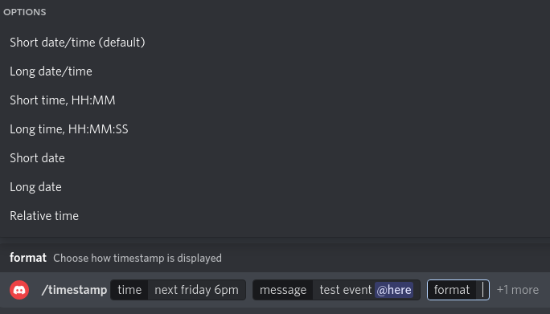
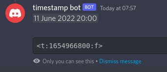

# discord-timestamp-bot

A bot for discord to print timestamps from string input using GNU date.

Bot generates timestamps with input that GNU date util accepts, for example:

 - now
 - today 8pm
 - next tuesday 16:00
 - 2022-01-01 20:00 +01:00

For more information, check [date input formats](https://www.gnu.org/software/coreutils/manual/html_node/Date-input-formats.html).

Bot has options for specifying timezone of the user, format of the timestamp and message for the channel

Bot responses with ephemeral message by default and with non-ephemeral message in a channel if message was included.

